# 📊 COMPREHENSIVE POST-MIGRATION FLOW DOCUMENTATION
## Detailed Page-Wise Sequence Diagrams for IP-OPS Platform

**Version:** 2.0 (Post-Migration)
**Date:** December 12, 2025
**Platform:** IP-OPS on Story Protocol
**Purpose:** Complete technical flow documentation with all backend APIs and Story SDK functions

---

## 📋 TABLE OF CONTENTS

1. [Architecture Overview](#1-architecture-overview)
2. [Backend API Endpoints](#2-backend-api-endpoints)
3. [Story Protocol SDK Functions](#3-story-protocol-sdk-functions)
4. [Page 1: Creator Dashboard (newIssuerDashboard.tsx)](#4-page-1-creator-dashboard)
5. [Page 2: User Portfolio (dashboard.tsx)](#5-page-2-user-portfolio)
6. [Page 3: License Marketplace (marketplace.tsx)](#6-page-3-license-marketplace)
7. [Page 4: Admin Panel (admin.tsx)](#7-page-4-admin-panel)
8. [Error Handling & Edge Cases](#8-error-handling--edge-cases)
9. [Data Models](#9-data-models)

---

## 1️⃣ ARCHITECTURE OVERVIEW

### **System Architecture**

```
┌─────────────────────────────────────────────────────────────────┐
│                    FRONTEND (React + TypeScript)                │
│  ┌──────────────────┐  ┌──────────────────┐  ┌──────────────┐  │
│  │ newIssuerDash    │  │ dashboard.tsx    │  │ marketplace  │  │
│  │ board.tsx        │  │                  │  │ .tsx         │  │
│  │ (Creator)        │  │ (User Portfolio) │  │ (Licensing)  │  │
│  └────────┬─────────┘  └────────┬─────────┘  └──────┬───────┘  │
│           │                     │                    │          │
│           └─────────────────────┴────────────────────┘          │
│                                 │                                │
│                    ┌────────────┴────────────┐                  │
│                    │ StoryProtocolService.ts │                  │
│                    │ (Story SDK Wrapper)     │                  │
│                    └────────────┬────────────┘                  │
└──────────────────────────────────┼───────────────────────────────┘
                                   │
                ┌──────────────────┴──────────────────┐
                │                                     │
                ▼                                     ▼
┌──────────────────────────────────┐  ┌──────────────────────────┐
│  BACKEND API (Node.js/Express)   │  │  STORY PROTOCOL SDK      │
│  ┌────────────────────────────┐  │  │  ┌────────────────────┐ │
│  │ Fingerprint Service        │  │  │  │ mintAndRegisterIp  │ │
│  │ POST /api/fingerprint      │  │  │  │ AndAttachPILTerms  │ │
│  │ POST /api/check-similarity │  │  │  │                    │ │
│  │ GET  /api/assets           │  │  │  │ registerDerivative │ │
│  │ POST /api/disputes/create  │  │  │  │                    │ │
│  │ GET  /api/disputes/pending │  │  │  │ mintLicenseTokens  │ │
│  │ POST /api/disputes/resolve │  │  │  │                    │ │
│  │ PATCH /api/assets/:hash    │  │  │  │ claimAllRevenue    │ │
│  └────────────┬───────────────┘  │  │  └────────────────────┘ │
│               │                   │  │                          │
│               ▼                   │  └──────────────────────────┘
│  ┌────────────────────────────┐  │
│  │ PostgreSQL Database        │  │
│  │ - ip_fingerprints          │  │
│  │ - similarity_disputes      │  │
│  │ - license_tokens           │  │
│  │ - royalty_claims           │  │
│  └────────────────────────────┘  │
└──────────────────────────────────┘
```

---

## 2️⃣ BACKEND API ENDPOINTS

### **Complete API Reference**

#### **A. Content Fingerprinting**

```typescript
POST /api/fingerprint
```

**Purpose:** Upload content file, generate fingerprint hash, upload to IPFS

**Request:**
```typescript
FormData {
  file: File,              // Content file (text, image, video, audio)
  title: string,           // Asset title
  walletAddress: string,   // Creator's wallet address
  ipType: 'Text' | 'Image' | 'Video' | 'Audio'
}
```

**Response:**
```json
{
  "success": true,
  "data": {
    "hash": "0xabc123...",           // SHA256 hash (Text) or perceptual hash (Image/Video)
    "ipfsCid": "QmXxx...",            // Pinata IPFS CID
    "fileSize": 1024,                 // File size in bytes
    "mimeType": "text/plain",         // MIME type
    "uploadedAt": "2025-12-12T10:00:00Z"
  }
}
```

**Backend Logic:**
```javascript
// For TEXT files
const normalizedText = fileContent.toLowerCase().replace(/\s+/g, ' ').trim();
const hash = crypto.createHash('sha256').update(normalizedText).digest('hex');

// For IMAGE files (future)
const pHash = await imageHash.hash(fileBuffer);

// Upload to IPFS
const ipfsCid = await pinata.pinFileToIPFS(file);

// Save to database
await db.ip_fingerprints.insert({
  hash,
  ipfs_cid: ipfsCid,
  wallet_address: walletAddress,
  title,
  ip_type: ipType,
  status: 'pending',
  created_at: new Date()
});
```

---

#### **B. Similarity Detection**

```typescript
POST /api/check-similarity
```

**Purpose:** Compare content hash against database to detect derivatives

**Request:**
```json
{
  "contentHash": "0xabc123..."
}
```

**Response:**
```json
{
  "success": true,
  "data": {
    "score": 92,                      // Similarity score (0-100)
    "status": "DERIVATIVE",           // CLEAN | WARNING | REVIEW_REQUIRED | DERIVATIVE
    "isMatch": true,                  // score >= 90
    "isPotentialMatch": false,        // score 70-89
    "needsReview": false,             // score 40-69
    "parentIpId": "0xIP_A...",        // Parent IP ID (if match found)
    "parentMetadata": {
      "title": "Original Song",
      "creator": "0x789...",
      "contentHash": "0x456def...",
      "ipfsCid": "QmYyy...",
      "licenseTermsId": "55"
    }
  }
}
```

**Backend Logic:**
```javascript
// Query database for similar hashes
const matches = await db.ip_fingerprints.find({
  hash: contentHash
});

if (matches.length === 0) {
  return { score: 0, status: 'CLEAN' };
}

// For exact match (TEXT MVP)
if (matches[0].hash === contentHash) {
  return {
    score: 100,
    status: 'DERIVATIVE',
    isMatch: true,
    parentIpId: matches[0].story_ip_id,
    parentMetadata: { ... }
  };
}

// For fuzzy matching (future - Levenshtein, perceptual hash)
const similarityScore = calculateLevenshteinSimilarity(contentHash, matches[0].hash);

// Branching logic
if (similarityScore < 40) return { score: similarityScore, status: 'CLEAN' };
if (similarityScore >= 40 && similarityScore < 70) return { score: similarityScore, status: 'WARNING', needsReview: true };
if (similarityScore >= 70 && similarityScore < 90) return { score: similarityScore, status: 'REVIEW_REQUIRED', isPotentialMatch: true };
if (similarityScore >= 90) return { score: similarityScore, status: 'DERIVATIVE', isMatch: true };
```

---

#### **C. Asset Management**

```typescript
GET /api/assets?walletAddress=0x...
```

**Purpose:** Fetch user's registered IP assets

**Response:**
```json
{
  "success": true,
  "data": [
    {
      "hash": "0xabc123...",
      "ipfsCid": "QmXxx...",
      "storyIpId": "0xIP_A...",
      "tokenId": "1",
      "title": "My Original Song",
      "ipType": "Text",
      "royaltyRate": 10,
      "licenseTermsId": "55",
      "status": "registered",
      "createdAt": "2025-12-12T10:00:00Z"
    }
  ]
}
```

---

```typescript
PATCH /api/assets/:hash/update
```

**Purpose:** Update fingerprint record with Story Protocol IP ID

**Request:**
```json
{
  "storyIpId": "0xIP_A...",
  "tokenId": "1",
  "licenseTermsId": "55",
  "status": "registered"
}
```

**Response:**
```json
{
  "success": true,
  "message": "Asset updated successfully"
}
```

---

#### **D. Dispute Management**

```typescript
POST /api/disputes/create
```

**Purpose:** Create similarity dispute for admin review

**Request:**
```json
{
  "submittedBy": "0x456...",
  "contentHash": "0xdef...",
  "contentTitle": "My Remix Song",
  "ipfsCid": "QmZzz...",
  "parentIpId": "0xIP_A...",
  "parentContentHash": "0xabc...",
  "similarityScore": 78
}
```

**Response:**
```json
{
  "success": true,
  "data": {
    "disputeId": "dispute_123",
    "status": "pending",
    "createdAt": "2025-12-12T10:00:00Z"
  }
}
```

---

```typescript
GET /api/disputes/pending
```

**Purpose:** Fetch all pending disputes for admin review

**Response:**
```json
{
  "success": true,
  "data": [
    {
      "disputeId": "dispute_123",
      "submittedBy": "0x456...",
      "contentHash": "0xdef...",
      "contentTitle": "My Remix Song",
      "ipfsCid": "QmZzz...",
      "parentIpId": "0xIP_A...",
      "parentMetadata": {
        "title": "Original Song",
        "creator": "0x789..."
      },
      "similarityScore": 78,
      "status": "pending",
      "createdAt": "2025-12-12T10:00:00Z"
    }
  ]
}
```

---

```typescript
POST /api/disputes/:disputeId/resolve
```

**Purpose:** Admin resolves dispute

**Request:**
```json
{
  "resolution": "approved_as_original" | "enforced_derivative",
  "adminAddress": "0xAdmin...",
  "notes": "Content is sufficiently transformative"
}
```

**Response:**
```json
{
  "success": true,
  "message": "Dispute resolved successfully",
  "resolution": "approved_as_original"
}
```

---

## 3️⃣ STORY PROTOCOL SDK FUNCTIONS

### **Combined Functions (Recommended)**

#### **A. mintAndRegisterIpAndAttachPILTerms**

**Purpose:** Mint NFT + Register IP + Attach License Terms in ONE transaction

```typescript
client.ipAsset.mintAndRegisterIpAndAttachPILTerms({
  spgNftContract: Address,        // SPG NFT collection address
  pilType: 'commercialRemix',     // License type
  ipMetadata: {
    ipMetadataURI: string,        // IPFS URI (ipfs://Qm...)
    ipMetadataHash: Hex,          // keccak256 hash (0x...)
    nftMetadataURI: string,       // Can be same as ipMetadataURI
    nftMetadataHash: Hex          // keccak256 hash (0x...)
  },
  commercialRevShare: number,     // Royalty % in basis points (1000 = 10%)
  currency: Address,              // WIP_TOKEN_ADDRESS
  mintingFee: bigint,             // Minting fee in wei (0 for free)
  txOptions: {
    waitForTransaction: true
  }
})

// Returns
{
  ipId: Address,           // THIS IS THE KEY! Global IP identifier
  tokenId: bigint,         // NFT token ID in collection
  licenseTermsId: bigint,  // Attached license terms ID
  txHash: string
}
```

**When to use:**
- Original content registration
- First-time IP creators
- Simplest flow for MVP

---

#### **B. registerDerivativeIp**

**Purpose:** Register derivative IP and link to parent

```typescript
client.ipAsset.registerDerivativeIp({
  nftContract: Address,           // SPG NFT collection
  tokenId: bigint,                // NFT token ID
  derivData: {
    parentIpIds: Address[],       // Array of parent IPs
    licenseTermsIds: bigint[],    // License terms from each parent
    licenseTemplate: Address,     // PIL template address
    royaltyContext: bytes         // Empty bytes for default
  },
  ipMetadata: {
    ipMetadataURI: string,
    ipMetadataHash: Hex,
    nftMetadataURI: string,
    nftMetadataHash: Hex
  },
  txOptions: {
    waitForTransaction: true
  }
})

// Returns
{
  ipId: Address,        // Child IP ID
  txHash: string
}
```

**When to use:**
- Derivative content registration (similarity >= 90%)
- User confirms they want to link to parent
- Automatic royalty flow setup

---

#### **C. mintLicenseTokens**

**Purpose:** Mint license token (buyer gets permission to use IP)

```typescript
client.license.mintLicenseTokens({
  licensorIpId: Address,         // Parent IP being licensed
  licenseTemplate: Address,      // PIL template address
  licenseTermsId: bigint,        // Which license terms to use
  amount: number,                // Number of licenses (usually 1)
  receiver: Address,             // Buyer's wallet
  royaltyContext: bytes,         // Empty bytes
  maxMintingFee: bigint,         // Max fee willing to pay (slippage)
  maxRevenueShare: number,       // Max royalty % willing to accept
  txOptions: {
    waitForTransaction: true
  }
})

// Returns
{
  licenseTokenIds: bigint[],  // Array of minted license token IDs
  txHash: string
}
```

**When to use:**
- Marketplace "Mint License" button
- User wants permission to use IP commercially
- Not creating derivative, just licensing

---

#### **D. payRoyaltyOnBehalf & claimRevenue**

**Purpose:** Pay royalties and claim revenue

```typescript
// Pay royalty
client.royalty.payRoyaltyOnBehalf({
  receiverIpId: Address,    // IP receiving payment
  payerIpId: Address,       // Who is paying (zeroAddress for external)
  token: Address,           // WIP_TOKEN_ADDRESS
  amount: bigint            // Amount in wei
})

// Claim revenue
client.royalty.claimRevenue({
  snapshotIds: bigint[],    // Revenue snapshot IDs
  account: Address,         // Claimer address
  token: Address            // Currency token
})

// Returns
{
  claimableRevenue: bigint,
  txHash: string
}
```

---

## 4️⃣ PAGE 1: CREATOR DASHBOARD

### **File:** `src/pages/Issuer/newIssuerDashboard.tsx`

---

### **SCENARIO A: ORIGINAL CONTENT REGISTRATION (Score < 40%)**

```mermaid
sequenceDiagram
    autonumber
    actor Alice as 🟢 Creator (Alice)
    participant FE as 🖥️ Frontend (React)
    participant API as ⚙️ Backend API
    participant DB as 🗄️ Database
    participant IPFS as 📦 IPFS (Pinata)
    participant SP as ⚡ Story Protocol SDK

    Note over Alice, SP: ORIGINAL CONTENT REGISTRATION FLOW

    Alice->>FE: 1. Upload "Original_Song.txt"
    activate FE

    FE->>FE: 2. handleRegisterIP() triggered
    FE->>API: 3. POST /api/fingerprint
    Note right of API: FormData: file, title, walletAddress, ipType='Text'

    activate API
    API->>API: 4. Generate SHA256 hash (normalizedText)
    API->>IPFS: 5. Upload file to Pinata
    IPFS-->>API: 6. Return IPFS CID (QmXxx...)
    API->>DB: 7. INSERT into ip_fingerprints
    Note right of DB: hash, ipfs_cid, wallet_address, title, status='pending'
    API-->>FE: 8. Return { hash, ipfsCid }
    deactivate API

    FE->>API: 9. POST /api/check-similarity
    Note right of API: Body: { contentHash: "0xabc..." }

    activate API
    API->>DB: 10. Query: SELECT * WHERE hash = ?
    DB-->>API: 11. No match found
    API-->>FE: 12. Return { score: 0, status: 'CLEAN', isMatch: false }
    deactivate API

    FE->>FE: 13. Score < 40% → Proceed as ORIGINAL
    FE->>IPFS: 14. Upload metadata JSON to Pinata
    Note right of IPFS: { title, description, ipType, contentHash, ipfsCid }
    IPFS-->>FE: 15. Return metadataURI (ipfs://Qm...)

    FE->>FE: 16. Calculate keccak256 hash of metadata
    FE->>Alice: 17. Prompt MetaMask signature
    Alice->>FE: 18. Signs transaction

    FE->>SP: 19. mintAndRegisterIpAndAttachPILTerms()
    Note right of SP: spgNftContract, pilType='commercialRemix',<br/>ipMetadata, commercialRevShare=1000 (10%),<br/>currency=WIP_TOKEN, mintingFee=0

    activate SP
    SP->>SP: 20. Mint NFT in SPG collection
    SP->>SP: 21. Register as IP Asset
    SP->>SP: 22. Attach Commercial Remix PIL terms
    SP-->>FE: 23. Return { ipId, tokenId, licenseTermsId, txHash }
    deactivate SP

    FE->>API: 24. PATCH /api/assets/:hash/update
    Note right of API: Body: { storyIpId, tokenId, licenseTermsId, status='registered' }

    activate API
    API->>DB: 25. UPDATE ip_fingerprints SET story_ip_id, status='registered'
    API-->>FE: 26. Return { success: true }
    deactivate API

    FE-->>Alice: 27. ✅ Success! IP Registered & Protected
    deactivate FE
```



**Key Points:**
- **Line 19:** Uses **combined function** `mintAndRegisterIpAndAttachPILTerms()` instead of 3 separate calls
- **Backend APIs:** `/api/fingerprint`, `/api/check-similarity`, `/api/assets/:hash/update`
- **Story SDK:** Single transaction for minting + registration + licensing
- **Database:** Stores hash, IPFS CID, Story IP ID for future similarity checks

---

### **SCENARIO B: DERIVATIVE DETECTION (Score 40-70% - Suggestion)**

```mermaid
sequenceDiagram
    autonumber
    actor Bob as 🔴 User (Bob)
    participant FE as 🖥️ Frontend
    participant API as ⚙️ Backend API
    participant SP as ⚡ Story Protocol

    Note over Bob, SP: SUGGESTION FLOW (Score 40-70%)

    Bob->>FE: Upload "Remix_Song.txt"
    FE->>API: POST /api/fingerprint
    API-->>FE: Return { hash: "0xdef..." }

    FE->>API: POST /api/check-similarity
    Note right of API: Body: { contentHash: "0xdef..." }

    API-->>FE: Return { score: 55, status: 'WARNING', needsReview: true }

    FE->>FE: Display warning dialog
    FE-->>Bob: ⚠️ "Similar content found. Are you sure this is original?"

    alt Bob confirms "Yes, I own this"
        Bob->>FE: Click "Proceed Anyway"
        FE->>SP: mintAndRegisterIpAndAttachPILTerms()
        Note right of SP: Proceeds as ORIGINAL (Bob claims ownership)
        SP-->>FE: Return { ipId, tokenId, licenseTermsId }
        FE-->>Bob: ✅ Registered as Original
    else Bob cancels
        Bob->>FE: Click "Cancel"
        FE-->>Bob: Upload cancelled
    end
```



---

### **SCENARIO C: ADMIN REVIEW REQUIRED (Score 70-90%)**

```mermaid
sequenceDiagram
    autonumber
    actor Bob as 🔴 User (Bob)
    participant FE as 🖥️ Frontend
    participant API as ⚙️ Backend API
    participant DB as 🗄️ Database

    Note over Bob, DB: GRAY AREA - ADMIN REVIEW (Score 70-90%)

    Bob->>FE: Upload "Remix_Song.txt"
    FE->>API: POST /api/fingerprint
    API-->>FE: Return { hash, ipfsCid }

    FE->>API: POST /api/check-similarity
    API-->>FE: Return { score: 78, status: 'REVIEW_REQUIRED', isPotentialMatch: true, parentIpId }

    FE->>API: POST /api/disputes/create
    Note right of API: Body: { submittedBy, contentHash, contentTitle,<br/>ipfsCid, parentIpId, parentContentHash, similarityScore }

    activate API
    API->>DB: INSERT into similarity_disputes
    API-->>FE: Return { disputeId: "dispute_123", status: 'pending' }
    deactivate API

    FE-->>Bob: ⏳ "Content held for review. Admin will be notified."

    Note over Bob, DB: Content is now pending admin review<br/>See Page 4 (Admin Panel) for resolution flow
```



---

### **SCENARIO D: DERIVATIVE DETECTED (Score >= 90%)**

```mermaid
sequenceDiagram
    autonumber
    actor Bob as 🔴 User (Bob)
    participant FE as 🖥️ Frontend
    participant API as ⚙️ Backend API
    participant IPFS as 📦 IPFS
    participant SP as ⚡ Story Protocol

    Note over Bob, SP: FORCED DERIVATIVE LINKING (Score >= 90%)

    Bob->>FE: Upload "Exact_Copy.txt"
    FE->>API: POST /api/fingerprint
    API-->>FE: Return { hash, ipfsCid }

    FE->>API: POST /api/check-similarity
    API-->>FE: Return { score: 95, status: 'DERIVATIVE', isMatch: true,<br/>parentIpId: "0xIP_A", parentMetadata: {...} }

    FE->>FE: Display RED ALERT dialog
    FE-->>Bob: 🛑 "Derivative Detected! You must link to parent IP"
    Note right of FE: Shows: Parent title, creator, similarity score

    Bob->>FE: Click "Link & Register as Derivative"

    FE->>IPFS: Upload derivative metadata to Pinata
    IPFS-->>FE: Return derivativeMetadataURI

    FE->>Bob: Prompt MetaMask signature
    Bob->>FE: Signs transaction

    FE->>SP: registerDerivativeIp()
    Note right of SP: nftContract=spgNftContract,<br/>derivData={ parentIpIds: [aliceIpId],<br/>licenseTermsIds: [aliceLicenseTermsId] },<br/>ipMetadata={ derivativeMetadataURI }

    activate SP
    SP->>SP: Mint NFT for Bob's derivative
    SP->>SP: Link bobIpId → aliceIpId
    SP->>SP: Set up royalty flow (Alice gets 10%, Bob gets 90%)
    SP-->>FE: Return { ipId: bobIpId, txHash }
    deactivate SP

    FE->>API: PATCH /api/assets/:hash/update
    Note right of API: Body: { storyIpId: bobIpId, isDerivative: true,<br/>parentIpId: aliceIpId, status: 'registered' }

    API-->>FE: Return { success: true }

    FE-->>Bob: ✅ Success! Derivative Registered & Linked to Parent
    Note right of Bob: When Bob earns revenue, Alice automatically gets her 10%
```



**Key Points:**
- **Line 18:** Uses `registerDerivativeIp()` function
- **Automatic Royalty Flow:** Story Protocol handles royalty splitting on-chain
- **Parent Attribution:** On-chain link from Bob's IP to Alice's IP

---

## 5️⃣ PAGE 2: USER PORTFOLIO

### **File:** `src/pages/dashboard/dashboard.tsx`

---

### **FETCH USER PORTFOLIO FLOW**

```mermaid
sequenceDiagram
    autonumber
    actor User as 👤 User
    participant FE as 🖥️ Frontend
    participant API as ⚙️ Backend API
    participant SP as ⚡ Story Protocol SDK
    participant IPFS as 📦 IPFS

    Note over User, IPFS: USER PORTFOLIO VIEW

    User->>FE: Visit Dashboard page
    activate FE

    FE->>FE: useEffect() → fetchUserPortfolio()

    FE->>API: GET /api/assets?walletAddress=0x...
    Note right of API: Query params: walletAddress

    activate API
    API->>API: Query ip_fingerprints WHERE wallet_address
    API-->>FE: Return registered IP assets
    deactivate API
    Note right of FE: Returns: [{ hash, ipfsCid, storyIpId, title, royaltyRate, ... }]

    loop For each IP asset
        FE->>SP: client.ipAsset.ipAsset(ipId)
        Note right of SP: Fetch on-chain IP details

        activate SP
        SP-->>FE: Return { owner, tokenContract, tokenId, resolver }
        deactivate SP

        FE->>IPFS: Fetch metadata from ipfsCid
        IPFS-->>FE: Return { title, description, attributes }

        FE->>FE: Merge backend + on-chain + IPFS data
    end

    FE->>SP: client.royalty.getClaimableRevenue(ipId, currency)
    Note right of SP: Check if user has claimable royalties

    activate SP
    SP-->>FE: Return { claimableRevenue: bigint }
    deactivate SP

    FE->>FE: Calculate portfolio metrics
    Note right of FE: Total IPs, Total Royalty Income, Active Licenses

    FE-->>User: Display Portfolio Dashboard
    deactivate FE
    Note right of User: Shows: Registered IPs, Owned Licenses,<br/>Royalty Income, Transaction History
```



---

### **CLAIM ROYALTY FLOW**

```mermaid
sequenceDiagram
    autonumber
    actor User as 👤 User
    participant FE as 🖥️ Frontend
    participant SP as ⚡ Story Protocol SDK

    Note over User, SP: CLAIM ROYALTY REVENUE

    User->>FE: Click "Claim Royalties" button
    activate FE

    FE->>FE: handleClaimRevenue()
    FE->>User: Prompt MetaMask signature
    User->>FE: Signs transaction

    FE->>SP: client.royalty.claimRevenue()
    Note right of SP: snapshotIds: [all pending snapshots],<br/>account: userAddress,<br/>token: WIP_TOKEN_ADDRESS

    activate SP
    SP->>SP: Calculate claimable amount
    SP->>SP: Transfer tokens from IP Royalty Vault to user
    SP-->>FE: Return { claimableRevenue, txHash }
    deactivate SP

    FE-->>User: ✅ Success! X WIP tokens claimed
    deactivate FE

    Note over User: Tokens now in user's wallet
```



---

## 6️⃣ PAGE 3: LICENSE MARKETPLACE

### **File:** `src/pages/marketplace/marketplace.tsx`

---

### **FETCH AVAILABLE IPS FLOW**

```mermaid
sequenceDiagram
    autonumber
    actor User as 👤 User
    participant FE as 🖥️ Frontend
    participant API as ⚙️ Backend API
    participant SP as ⚡ Story Protocol SDK

    Note over User, SP: MARKETPLACE - FETCH AVAILABLE IPs

    User->>FE: Visit Marketplace page
    activate FE

    FE->>FE: useEffect() → loadAvailableIPs()

    FE->>API: GET /api/marketplace/available-ips
    Note right of API: Optional filters: ipType, minRoyalty, maxRoyalty

    activate API
    API->>API: Query ip_fingerprints WHERE status='registered'
    API-->>FE: Return available IP listings
    deactivate API
    Note right of FE: Returns: [{ storyIpId, title, royaltyRate,<br/>licenseTermsId, ipfsCid, creator, ... }]

    loop For each IP listing
        FE->>SP: client.license.licenseTerms(licenseTermsId)
        Note right of SP: Fetch license terms details

        activate SP
        SP-->>FE: Return { commercialUse, derivativesAllowed,<br/>commercialRevShare, mintingFee, currency }
        deactivate SP
    end

    FE->>FE: Filter & sort listings
    FE-->>User: Display Marketplace listings
    deactivate FE
    Note right of User: Shows: IP cards with title, image,<br/>royalty %, license type, mint button
```



---

### **MINT LICENSE FLOW**

```mermaid
sequenceDiagram
    autonumber
    actor User as 👤 User
    participant FE as 🖥️ Frontend
    participant SP as ⚡ Story Protocol SDK
    participant API as ⚙️ Backend API

    Note over User, API: MARKETPLACE - MINT LICENSE

    User->>FE: Click "Mint License" on IP listing
    activate FE

    FE->>FE: Show License Modal
    FE-->>User: Display license terms & minting fee
    Note right of User: Shows: Royalty %, Commercial use allowed,<br/>Derivatives allowed, Minting fee

    User->>FE: Click "Confirm & Mint"
    FE->>User: Prompt MetaMask signature
    User->>FE: Signs transaction

    FE->>SP: client.license.mintLicenseTokens()
    Note right of SP: licensorIpId: ipId,<br/>licenseTemplate: PIL_TEMPLATE,<br/>licenseTermsId: termId,<br/>amount: 1,<br/>receiver: userAddress,<br/>maxMintingFee: fee,<br/>maxRevenueShare: 100

    activate SP
    SP->>SP: Charge minting fee (if any)
    SP->>SP: Mint License NFT to user
    SP->>SP: Record license in registry
    SP-->>FE: Return { licenseTokenIds: [101], txHash }
    deactivate SP

    FE->>API: POST /api/licenses/record
    Note right of API: Body: { licenseTokenId, ipId, licensee, mintedAt }

    activate API
    API->>API: INSERT into license_tokens table
    API-->>FE: Return { success: true }
    deactivate API

    FE-->>User: ✅ Success! License minted (Token ID: 101)
    deactivate FE

    Note over User: User now has permission to use IP<br/>according to license terms
```



**Key Difference from Flow Blockchain:**
- **OLD (Flow):** `buyToken()` → User owns ERC1155 token fractions
- **NEW (Story):** `mintLicenseTokens()` → User owns LICENSE to use IP (not the IP itself)

---

## 7️⃣ PAGE 4: ADMIN PANEL

### **File:** `src/pages/admin/admin.tsx`

---

### **FETCH PENDING DISPUTES FLOW**


---

### **RESOLVE DISPUTE - APPROVE AS ORIGINAL**

```mermaid
sequenceDiagram
    autonumber
    actor Admin as ⚖️ Admin
    participant FE as 🖥️ Frontend
    participant API as ⚙️ Backend API
    participant SP as ⚡ Story Protocol SDK

    Note over Admin, SP: ADMIN RESOLVES - APPROVE AS ORIGINAL

    Admin->>FE: Review Dispute #123 (Score: 78%)
    Admin->>FE: Click "Approve as Original"

    activate FE
    FE->>API: POST /api/disputes/dispute_123/resolve
    Note right of API: Body: { resolution: 'approved_as_original',<br/>adminAddress, notes: '...' }

    activate API
    API->>API: UPDATE similarity_disputes SET status='approved_as_original'
    API-->>FE: Return { success: true }
    deactivate API

    FE->>SP: mintAndRegisterIpAndAttachPILTerms()
    Note right of SP: Register Bob's content as ORIGINAL<br/>(no link to parent)

    activate SP
    SP-->>FE: Return { ipId, tokenId, licenseTermsId }
    deactivate SP

    FE-->>Admin: ✅ Dispute resolved - Registered as Original
    deactivate FE

    Note over Admin: Bob's content is now registered<br/>as independent IP asset
```



---

### **RESOLVE DISPUTE - ENFORCE DERIVATIVE LINK**

```mermaid
sequenceDiagram
    autonumber
    actor Admin as ⚖️ Admin
    participant FE as 🖥️ Frontend
    participant API as ⚙️ Backend API
    participant SP as ⚡ Story Protocol SDK

    Note over Admin, SP: ADMIN RESOLVES - ENFORCE DERIVATIVE

    Admin->>FE: Review Dispute #123 (Score: 78%)
    Admin->>FE: Click "Enforce Derivative Link"

    activate FE
    FE->>API: POST /api/disputes/dispute_123/resolve
    Note right of API: Body: { resolution: 'enforced_derivative',<br/>adminAddress, notes: 'Clear similarity' }

    activate API
    API->>API: UPDATE similarity_disputes SET status='enforced_derivative'

    API->>SP: registerDerivativeIp() (Using admin wallet)
    Note right of SP: childIpId: Bob's pending IP,<br/>parentIpIds: [Alice's IP],<br/>licenseTermsIds: [Alice's terms]

    activate SP
    SP->>SP: Link Bob's IP → Alice's IP
    SP->>SP: Set up royalty flow
    SP-->>API: Return { txHash }
    deactivate SP

    API-->>FE: Return { success: true, txHash }
    deactivate API

    FE-->>Admin: ✅ Derivative link enforced
    deactivate FE

    Note over Admin: Bob's content is now registered<br/>as derivative with automatic royalties to Alice
```



**Key Points:**
- **Admin Wallet:** Backend has admin private key for enforcement actions
- **Gas Fees:** Admin pays gas for enforcement
- **On-Chain Enforcement:** Cannot be reversed by Bob

---

## 8️⃣ ERROR HANDLING & EDGE CASES

### **A. Fingerprinting Errors**

```typescript
// Frontend: handleRegisterIP()
try {
  const fingerprint = await contentFingerprintService.uploadAndFingerprint(file, title, address);
} catch (error) {
  if (error.code === 'FILE_TOO_LARGE') {
    toast.error('File size exceeds 100MB limit');
  } else if (error.code === 'IPFS_UPLOAD_FAILED') {
    toast.error('IPFS upload failed. Please try again.');
  } else if (error.code === 'UNSUPPORTED_FILE_TYPE') {
    toast.error('File type not supported. Please upload Text, Image, Video, or Audio.');
  } else {
    toast.error('Fingerprinting failed. Please try again.');
  }
  return;
}
```

---

### **B. Story Protocol Transaction Errors**

```typescript
// Frontend: mintAndRegisterIpAndAttachPILTerms()
try {
  const result = await client.ipAsset.mintAndRegisterIpAndAttachPILTerms({ ... });
} catch (error) {
  if (error.message.includes('user rejected')) {
    toast.error('Transaction cancelled by user');
  } else if (error.message.includes('insufficient funds')) {
    toast.error('Insufficient funds for gas fees');
  } else if (error.message.includes('SPG NFT collection not found')) {
    toast.error('NFT collection not initialized. Please contact support.');
  } else if (error.message.includes('invalid metadata hash')) {
    toast.error('Metadata validation failed. Please check your inputs.');
  } else {
    toast.error('Registration failed. Please try again.');
  }
  return;
}
```

---

### **C. Network Errors**

```typescript
// WalletContext.tsx - Network validation
const REQUIRED_CHAIN_ID = 11155111; // Story Sepolia

useEffect(() => {
  if (!isConnected) return;

  const checkNetwork = async () => {
    const network = await provider.getNetwork();

    if (network.chainId !== REQUIRED_CHAIN_ID) {
      toast.error('Wrong network! Switching to Story Sepolia...');

      try {
        await window.ethereum.request({
          method: 'wallet_switchEthereumChain',
          params: [{ chainId: `0x${REQUIRED_CHAIN_ID.toString(16)}` }]
        });
      } catch (switchError) {
        // Network not added, add it
        if (switchError.code === 4902) {
          await window.ethereum.request({
            method: 'wallet_addEthereumChain',
            params: [{
              chainId: `0x${REQUIRED_CHAIN_ID.toString(16)}`,
              chainName: 'Story Protocol Sepolia',
              rpcUrls: ['https://rpc-sepolia.story.foundation'],
              blockExplorerUrls: ['https://testnet.storyscan.xyz'],
              nativeCurrency: {
                name: 'Ethereum',
                symbol: 'ETH',
                decimals: 18
              }
            }]
          });
        }
      }
    }
  };

  checkNetwork();
}, [isConnected, provider]);
```

---

### **D. Similarity Check Edge Cases**

```typescript
// Backend: /api/check-similarity

// Edge Case 1: Multiple parents with same score
if (matches.length > 1 && matches[0].score === matches[1].score) {
  return {
    score: matches[0].score,
    status: 'REVIEW_REQUIRED',
    isPotentialMatch: true,
    parentIpId: null, // Cannot determine single parent
    multipleMatches: matches.map(m => m.story_ip_id)
  };
}

// Edge Case 2: Parent IP has been removed/burned
const parentExists = await storyProtocol.ipAsset.ipAsset(parentIpId);
if (!parentExists) {
  return {
    score: 0,
    status: 'CLEAN',
    message: 'Parent IP no longer exists'
  };
}

// Edge Case 3: Circular derivative (Bob's derivative of Alice, Charlie tries to copy Bob)
const derivativeChain = await checkDerivativeChain(parentIpId);
if (derivativeChain.length > 3) {
  return {
    score: similarityScore,
    status: 'REVIEW_REQUIRED',
    warning: 'Deep derivative chain detected (3+ levels)'
  };
}
```

---

## 9️⃣ DATA MODELS

### **A. PostgreSQL Schema**

```sql
-- IP Fingerprints Table
CREATE TABLE ip_fingerprints (
  id SERIAL PRIMARY KEY,
  hash VARCHAR(66) NOT NULL UNIQUE,           -- Content hash (0x...)
  ipfs_cid VARCHAR(100) NOT NULL,             -- Pinata IPFS CID
  wallet_address VARCHAR(42) NOT NULL,        -- Creator address
  story_ip_id VARCHAR(66),                    -- Story Protocol IP ID
  token_id BIGINT,                            -- NFT token ID
  license_terms_id BIGINT,                    -- License terms ID
  title VARCHAR(255) NOT NULL,
  description TEXT,
  ip_type VARCHAR(20) DEFAULT 'Text',         -- Text, Image, Video, Audio
  royalty_rate INTEGER DEFAULT 10,            -- Royalty % (0-100)
  status VARCHAR(30) DEFAULT 'pending',       -- pending, registered, rejected
  is_derivative BOOLEAN DEFAULT false,
  parent_ip_id VARCHAR(66),                   -- Parent IP (if derivative)
  created_at TIMESTAMP DEFAULT NOW(),
  updated_at TIMESTAMP DEFAULT NOW()
);

-- Similarity Disputes Table
CREATE TABLE similarity_disputes (
  id SERIAL PRIMARY KEY,
  dispute_id VARCHAR(50) UNIQUE NOT NULL,
  submitted_by VARCHAR(42) NOT NULL,          -- Uploader address
  content_hash VARCHAR(66) NOT NULL,          -- Disputed content hash
  content_title VARCHAR(255),
  ipfs_cid VARCHAR(100),
  parent_ip_id VARCHAR(66),                   -- Potential parent IP
  parent_content_hash VARCHAR(66),
  similarity_score INTEGER NOT NULL,          -- 0-100
  status VARCHAR(30) DEFAULT 'pending',       -- pending, approved_as_original, enforced_derivative
  resolved_by VARCHAR(42),                    -- Admin address
  resolution_notes TEXT,
  resolved_at TIMESTAMP,
  created_at TIMESTAMP DEFAULT NOW()
);

-- License Tokens Table (for tracking)
CREATE TABLE license_tokens (
  id SERIAL PRIMARY KEY,
  license_token_id BIGINT NOT NULL,
  ip_id VARCHAR(66) NOT NULL,                 -- Licensed IP
  licensee VARCHAR(42) NOT NULL,              -- License holder
  license_terms_id BIGINT NOT NULL,
  minted_at TIMESTAMP DEFAULT NOW()
);

-- Royalty Claims Table (for analytics)
CREATE TABLE royalty_claims (
  id SERIAL PRIMARY KEY,
  ip_id VARCHAR(66) NOT NULL,
  claimer VARCHAR(42) NOT NULL,
  amount DECIMAL(30, 0) NOT NULL,             -- Amount in wei
  currency VARCHAR(42) NOT NULL,              -- Token address
  tx_hash VARCHAR(66) NOT NULL,
  claimed_at TIMESTAMP DEFAULT NOW()
);

-- Indexes for performance
CREATE INDEX idx_fingerprints_hash ON ip_fingerprints(hash);
CREATE INDEX idx_fingerprints_wallet ON ip_fingerprints(wallet_address);
CREATE INDEX idx_fingerprints_story_ip ON ip_fingerprints(story_ip_id);
CREATE INDEX idx_disputes_status ON similarity_disputes(status);
CREATE INDEX idx_license_tokens_licensee ON license_tokens(licensee);
```

---

### **B. Frontend Type Definitions**

```typescript
// src/types/ipAsset.ts

export interface IPAsset {
  hash: string;                    // Content hash
  ipfsCid: string;                 // IPFS CID
  storyIpId: Address;              // Story Protocol IP ID
  tokenId: bigint;                 // NFT token ID
  title: string;
  description: string;
  ipType: 'Text' | 'Image' | 'Video' | 'Audio';
  royaltyRate: number;             // 0-100
  licenseTermsId: bigint;
  creator: Address;
  status: 'pending' | 'registered' | 'rejected';
  isDerivative: boolean;
  parentIpId?: Address;
  createdAt: Date;
}

export interface SimilarityCheckResult {
  score: number;                   // 0-100
  status: 'CLEAN' | 'WARNING' | 'REVIEW_REQUIRED' | 'DERIVATIVE';
  isMatch: boolean;                // score >= 90
  isPotentialMatch: boolean;       // score 70-89
  needsReview: boolean;            // score 40-69
  parentIpId?: Address;
  parentMetadata?: {
    title: string;
    creator: Address;
    contentHash: string;
    ipfsCid: string;
    licenseTermsId: bigint;
  };
}

export interface Dispute {
  disputeId: string;
  submittedBy: Address;
  contentHash: string;
  contentTitle: string;
  ipfsCid: string;
  parentIpId: Address;
  parentContentHash: string;
  similarityScore: number;
  status: 'pending' | 'approved_as_original' | 'enforced_derivative';
  resolvedBy?: Address;
  resolutionNotes?: string;
  resolvedAt?: Date;
  createdAt: Date;
}

export interface LicenseToken {
  licenseTokenId: bigint;
  ipId: Address;
  licensee: Address;
  licenseTermsId: bigint;
  mintedAt: Date;
}
```

---

## 📝 SUMMARY OF KEY CHANGES

### **What Changed from Flow → Story**

| Aspect | Flow Blockchain (OLD) | Story Protocol (NEW) |
|--------|----------------------|----------------------|
| **Upload Flow** | Upload → Submit → Wait Approval → Deploy → List | Upload → Fingerprint → Check Similarity → Register → Attach License |
| **Approval** | Admin approval required | No approval (automatic registration) |
| **Derivative Tracking** | Not implemented | Automatic with similarity detection |
| **Smart Contract Calls** | 5+ separate transactions | 1 combined transaction (`mintAndRegisterIpAndAttachPILTerms`) |
| **Buy Button** | `buyToken()` → Own fractions | `mintLicenseTokens()` → Own license |
| **Royalties** | Manual via PaymentSplitter | Automatic on-chain distribution |
| **Backend Role** | Minimal (JWT auth only) | Central (fingerprinting, similarity, disputes) |
| **Admin Role** | Token approval | Dispute resolution |

---

### **New Backend API Endpoints**

1. `POST /api/fingerprint` - Generate content hash + IPFS upload
2. `POST /api/check-similarity` - Detect derivatives
3. `GET /api/assets` - Fetch user IPs
4. `PATCH /api/assets/:hash/update` - Update with Story IP ID
5. `POST /api/disputes/create` - Create dispute
6. `GET /api/disputes/pending` - Fetch pending disputes
7. `POST /api/disputes/:disputeId/resolve` - Admin resolve

---

### **Story Protocol SDK Functions Used**

1. `client.ipAsset.mintAndRegisterIpAndAttachPILTerms()` - **Combined function** for original IPs
2. `client.ipAsset.registerDerivativeIp()` - Register derivative + link to parent
3. `client.license.mintLicenseTokens()` - Mint license for user
4. `client.royalty.claimRevenue()` - Claim royalties
5. `client.ipAsset.ipAsset()` - Query IP details
6. `client.license.licenseTerms()` - Query license terms

---

## ✅ MIGRATION CHECKLIST

- [ ] Backend API implemented (7 endpoints)
- [ ] PostgreSQL database setup (4 tables)
- [ ] StoryProtocolService.ts created
- [ ] ContentFingerprintService.ts created
- [ ] DisputeResolutionService.ts created
- [ ] newIssuerDashboard.tsx migrated (4 scenarios)
- [ ] dashboard.tsx migrated (portfolio view + claim)
- [ ] marketplace.tsx migrated (license minting)
- [ ] admin.tsx migrated (dispute resolution)
- [ ] WalletContext.tsx updated (Story Aeined network)
- [ ] Error handling implemented
- [ ] Testing completed

---

**END OF COMPREHENSIVE FLOW DOCUMENTATION**

This document provides complete technical flows for all 4 pages after migration, with all backend APIs and Story SDK functions properly mapped. Each sequence diagram shows the exact flow with request/response details.
