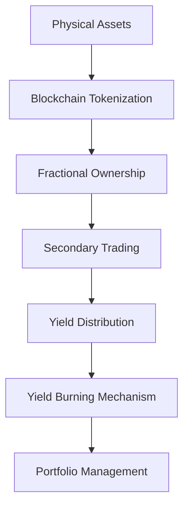
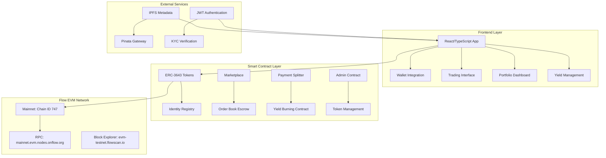
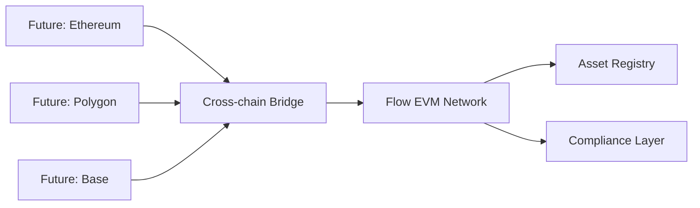
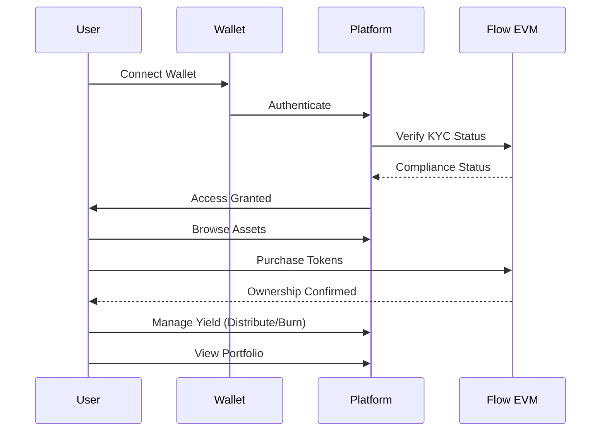
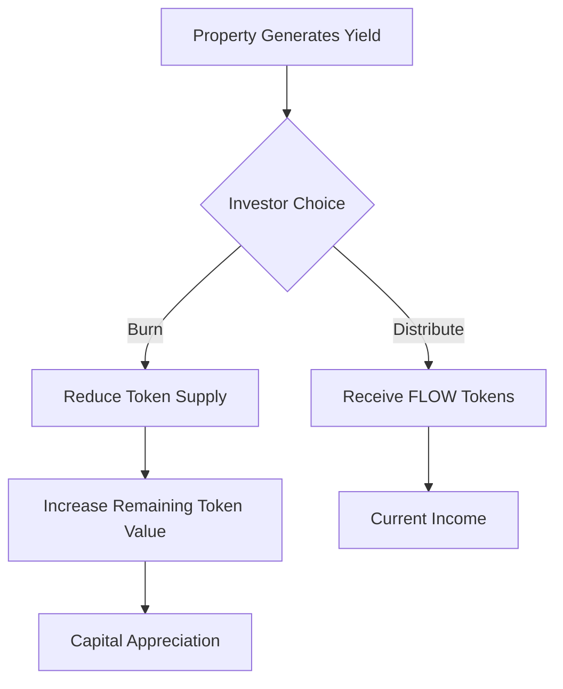
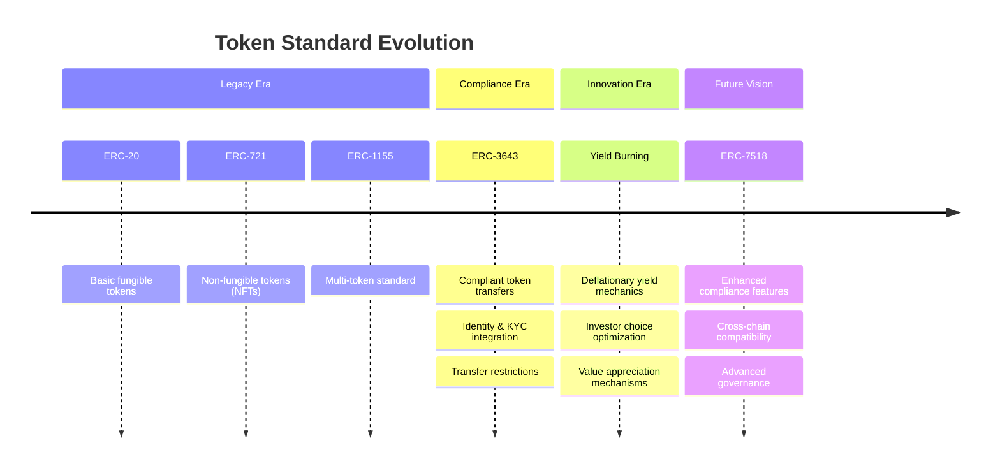
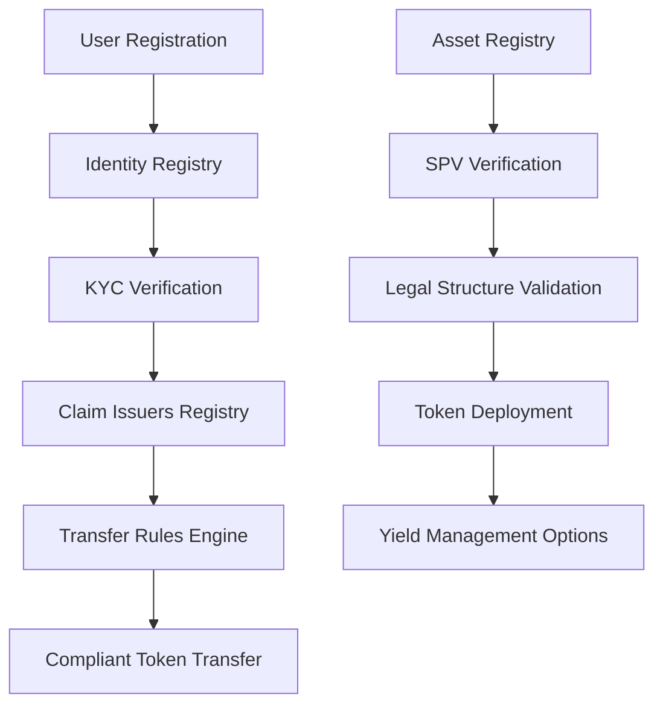

# orion (TOA) - Real World Asset Tokenization Platform

> **Democratizing premium real-world asset investment through blockchain technology on the Flow EVM Network**

[](https://flow.com/)
[](https://eips.ethereum.org/EIPS/eip-3643)
[](https://www.typescriptlang.org/)
[](https://reactjs.org/)
[](https://vitejs.dev/)

---

## Project Goals

orion addresses the **$280 trillion global real estate market** accessibility problem by creating a compliant, secure, and liquid platform for Real World Asset (RWA) tokenization on Flow EVM.

### Key Objectives
- **Democratize Premium Assets**: Enable fractional ownership of high-value real estate, commodities, and revenue streams
- **Regulatory Compliance**: Implement ERC-3643 standard with comprehensive KYC/AML protocols
- **Enhanced Liquidity**: Create secondary marketplace with peer-to-peer trading capabilities
- **Sustainable Yield Management**: Innovative yield burning mechanism for asset appreciation
- **Cross-Chain Ready**: Built for Flow EVM with multi-chain expansion potential



---

## Revolutionary Features

### **🔥 Yield Burning Mechanism**
- **Asset Appreciation**: Burn yield tokens to increase remaining token value
- **Deflationary Economics**: Reduces token supply while maintaining asset backing
- **Investor Choice**: Choose between yield distribution or token value appreciation
- **Smart Contract Automation**: Transparent burning process with on-chain verification

### **Compliance & Security**
- **ERC-3643 Standard**: Regulatory-compliant token transfers with built-in KYC validation
- **Multi-signature Security**: Enhanced security for high-value asset transactions
- **SPV Integration**: Special Purpose Vehicle verification for legal asset backing
- **Merkle Tree KYC**: Efficient batch verification system for user onboarding

### **Core Platform Features**
- **Asset Tokenization Workflow**: Complete issuer-to-marketplace pipeline
- **Primary Marketplace**: Direct asset investment with compliance checks
- **Secondary P2P Trading**: Orderbook-based peer-to-peer asset trading
- **Real-time Portfolio Dashboard**: Comprehensive investment tracking and analytics
- **Automated Yield Distribution**: Smart contract-based revenue sharing

### **Advanced Trading & Analytics**
- **Interactive Trading Terminal**: Professional-grade interface with real-time charts
- **Order Book Management**: Deep liquidity with escrow-secured transactions
- **Price Discovery**: Dynamic pricing with Flow/USD conversion
- **Performance Analytics**: Asset performance tracking and yield calculations

### **User Experience**
- **Responsive Design**: Mobile-first approach with modern UI/UX
- **Real-time Notifications**: Live updates for trading and yield activities
- **Intuitive Navigation**: Role-based dashboards (Investor/Issuer/Manager/Admin)
- **Dark/Light Mode**: Customizable interface themes

---

## Architecture Overview



### Enhanced Data Flow Architecture
1. **Asset Submission** → Issuer submits tokenization request with metadata
2. **Compliance Check** → KYC verification and regulatory validation
3. **Token Deployment** → ERC-3643 token creation with compliance rules
4. **Marketplace Listing** → Asset available for primary investment
5. **Secondary Trading** → P2P trading with escrow security
6. **Yield Management** → Choose between distribution or burning
7. **Portfolio Optimization** → Automated rebalancing and performance tracking

---

## Flow EVM Network Integration

orion is natively built on the **Flow EVM Network**, leveraging its high-performance blockchain infrastructure optimized for real-world assets:

### Network Specifications
- **Chain ID**: 747 (Testnet/Mainnet)
- **Native Currency**: FLOW Token
- **Block Time**: ~1-2 seconds
- **Transaction Finality**: Near-instant
- **Gas Efficiency**: Ultra-low fees for DeFi operations
- **EVM Compatibility**: Full Ethereum tooling support

### Smart Contract Deployment
```typescript
// Production Contract Addresses (Flow EVM Network)
ADMIN: "0xFC53E7A6b94173D82d07a127A38d9D852bf478d4", // Flow Admin contract for issuer authorization
USER_REGISTRY: "0x651458505D6ED8Cc85f76BE9428F56b40aC472B2", // UserRegistry for user management
TOKEN: "0x7C082010BcF338675508E2FD9d6C0dD2E43b37d8", // ERC1155Core with advanced minting capabilities
ISSUER: "0xad367F8b04bC9C373aDcE2a1E797A3c4f1aD5D78", // Issuer contract for token creation
MARKETPLACE: "0xE8DE43BD00370F48db7Ac139146AC27B1AfEd7aF", // Primary marketplace with withdrawal support
TOKEN_MANAGEMENT: "0xA632A492cCd898De4a4B17DC786B381d099F5815", // Complete workflow with marketplace integration

ORDER_BOOK_ESCROW: "0x0E3b53858E1F086D6ff1a1613e2d0d951237E949", // Fully on-chain escrow order book
PAYMENT_SPLITTER: "0x6f2db3e628879ee72B455a946C1d6cfBa51aac91", // Advanced payment splitter with yield burning

// ERC-3643 Compliance Infrastructure
IDENTITY_REGISTRY: "0x1",
CLAIM_ISSUERS_REGISTRY: "0x2",
RULE_CONTRACT: "0x3",
ASSET_REGISTRY: "0x4",
MASTER_TOKEN: "0x5",
MULTISIG: "0x6",
TOKEN_FACTORY: "0x6",
WATERFALL_CONTRACT: "0x7",
MERKLE_KYC: "0x8"
```

### Cross-Chain Architecture


---

## Getting Started

### Prerequisites
- **Node.js**: v18+ 
- **npm**: v9+
- **MetaMask**: Browser wallet extension
- **Git**: Version control

### 🔧 Installation & Setup

1. **Clone Repository**
```bash
git clone https://github.com/orion/TOA-Client-VB.git
cd TOA-Client-VB
```

2. **Install Dependencies**
```bash
# Install frontend dependencies
npm install

# Install API proxy dependencies
npm run proxy:install
```

3. **Environment Configuration**
```bash
# Create environment file
cp .env.example .env.local

# Configure environment variables
VITE_JWT_SECRET=your_pinata_jwt_token
VITE_NETWORK=flow_testnet
VITE_RPC_URL=https://mainnet.evm.nodes.onflow.org/
```

4. **Development Server**
```bash
# Start full development environment
npm run dev:full

# Or start individually
npm run dev        # Frontend only
npm run proxy      # API proxy only
```

5. **Network Setup**
```bash
# Add Flow EVM Network to MetaMask
Network Name: Flow EVM Testnet
RPC URL: https://mainnet.evm.nodes.onflow.org/
Chain ID: 747
Currency Symbol: FLOW
Block Explorer: https://www.flowscan.io/
```

### Demo Workflow



---

## Usage Instructions

### **Investor Journey**

#### 1. **Onboarding & KYC**
- Connect MetaMask wallet to Flow EVM Network
- Complete KYC verification process
- Receive compliance verification status

#### 2. **Asset Investment**
```typescript
// Example: Purchase Real Estate Token
const purchaseAsset = async (tokenId: string, amount: number) => {
  // Compliance check
  await complianceService.checkUserStatus(userAddress);
  
  // Execute purchase
  const tx = await marketplaceContract.purchaseAsset(tokenId, amount);
  await tx.wait();
};
```

#### 3. **🔥 Yield Management (NEW)**
```typescript
// Choose between yield distribution or burning
const manageYield = async (tokenId: string, action: 'distribute' | 'burn') => {
  if (action === 'burn') {
    // Burn yield to increase token value
    const tx = await yieldBurningContract.burnYield(tokenId);
    await tx.wait();
  } else {
    // Distribute yield to wallet
    const tx = await paymentSplitter.distributeYield(tokenId);
    await tx.wait();
  }
};
```

#### 4. **Portfolio Management**
- **Real-time Dashboard**: Track asset performance and yields
- **Yield Strategy**: Choose between income vs. appreciation
- **Transaction History**: View all investment activities
- **Performance Analytics**: Advanced metrics and ROI tracking

#### 5. **Secondary Trading**
- **P2P Marketplace**: Trade assets with other verified investors
- **Order Book**: Place buy/sell orders with escrow security
- **Price Discovery**: Real-time market pricing with Flow liquidity

### **Issuer Workflow**

#### 1. **Asset Submission**
```typescript
// Asset tokenization request
const submitAsset = async (assetData: AssetMetadata) => {
  const metadataURI = await uploadToIPFS(assetData);
  const tx = await tokenManagement.submitTokenRequest(
    assetData.name,
    assetData.symbol,
    assetData.totalSupply,
    metadataURI
  );
};
```

#### 2. **Compliance & Approval**
- Submit asset documentation and legal structure
- Regulatory review and due diligence process
- Admin approval and token deployment authorization

#### 3. **Token Deployment & Listing**
- ERC-3643 compliant token creation
- Automatic marketplace listing with yield options
- Investor marketing and distribution

### **Manager Operations**

#### 1. **Enhanced Yield Distribution**
```typescript
// Submit rental/dividend income with burning option
const distributeYield = async (tokenId: string, amount: string, allowBurning: boolean) => {
  const amountWei = ethers.utils.parseEther(amount);
  const tx = await paymentSplitter.submitRental(tokenId, allowBurning, {
    value: amountWei
  });
  await tx.wait();
};
```

#### 2. **Asset Performance Monitoring**
- Property management and maintenance tracking
- Yield optimization analysis
- Burn vs. distribute recommendations
- Investor communication and updates

---

## Yield Burning Innovation

### **How Yield Burning Works**



### **Economic Model**
- **Deflationary Mechanism**: Burning reduces circulating supply
- **Value Appreciation**: Fewer tokens represent same underlying asset value
- **Investor Flexibility**: Choose income vs. growth strategy
- **Market Dynamics**: Creates natural price pressure for burned assets

### **Implementation Benefits**
- **Tax Optimization**: Capital gains vs. income treatment
- **Portfolio Diversification**: Mix income and growth assets
- **Market Efficiency**: Reduces sell pressure from yield farmers
- **Long-term Value**: Builds sustainable asset appreciation

---

## Token Standards & Compliance

### ERC-3643 → ERC-7518 Evolution Timeline



### Compliance Architecture



### Key Compliance Features

#### **Identity & KYC Management**
- **Identity Registry**: On-chain identity management for all participants
- **KYC Vendors**: Integrated third-party verification services  
- **Claim Issuers**: Authorized entities for compliance attestation
- **Merkle Tree Verification**: Efficient batch KYC processing

#### **Transfer Restrictions**
```solidity
// Example: ERC-3643 compliant transfer with yield burning
function transfer(address to, uint256 amount) public returns (bool) {
    require(identityRegistry.isRegistered(msg.sender), "Sender not registered");
    require(identityRegistry.isRegistered(to), "Recipient not registered");
    require(ruleEngine.validateTransfer(msg.sender, to, amount), "Transfer not allowed");
    
    // Update yield burn eligibility
    yieldManager.updateBurnEligibility(msg.sender, to, amount);
    
    return super.transfer(to, amount);
}
```

#### **Regulatory Integration**
- **Multi-jurisdiction Support**: Configurable compliance rules per region
- **Automated Reporting**: Transaction monitoring and suspicious activity detection
- **Legal Framework**: Integration with existing financial regulations
- **Yield Compliance**: Tax-optimized yield management strategies

---

## Impact & Value Proposition

### **Market Democratization**
- **$280T+ Real Estate Market**: Previously inaccessible to retail investors
- **Minimum Investment**: As low as $100 vs. traditional $500K+ requirements
- **Global Access**: 24/7 trading across international markets
- **Fractional Ownership**: Own portions of premium assets worldwide

### **Investment Benefits**

#### For Investors
- **Flexible Yields**: Choose between 8-12% income or capital appreciation
- **Yield Burning Advantage**: Unique deflationary mechanism for value growth
- **Diversification**: Access to multiple asset classes and geographies
- **Enhanced Liquidity**: Secondary market trading vs. traditional illiquid investments
- **Transparency**: Blockchain-based performance tracking and verification

#### For Issuers  
- **Capital Access**: Tap into global investor base for asset financing
- **Yield Flexibility**: Offer investors choice between income and growth
- **Reduced Costs**: Lower issuance and management fees vs. traditional REITs
- **Compliance Automation**: Built-in regulatory compliance and reporting
- **Market Efficiency**: Streamlined investor onboarding and management

### **Ecosystem Benefits**
- **Market Innovation**: Pioneer yield burning mechanism in RWA space
- **Financial Inclusion**: Access for underserved investor demographics
- **Value Creation**: Deflationary tokenomics drive sustainable growth
- **Regulatory Leadership**: Proactive compliance framework development

---

## 📁 Folder Structure

```
TOA-Client-VB/
├── Frontend Application
│   ├── src/
│   │   ├── components/          # Reusable UI components
│   │   │   ├── ui/             # Base UI library (shadcn/ui)
│   │   │   ├── marketplace/    # Marketplace-specific components
│   │   │   ├── admin/          # Admin dashboard components
│   │   │   └── issuer/         # Issuer workflow components
│   │   ├── pages/              # Route-based page components
│   │   │   ├── dashboard/      # Investor dashboard with yield management
│   │   │   ├── marketplace/    # Asset marketplace
│   │   │   ├── orderbook/      # Advanced trading interface
│   │   │   └── admin/          # Administrative interface
│   │   ├── services/           # Business logic & blockchain integration
│   │   │   ├── metadataService.ts     # IPFS metadata management
│   │   │   ├── tradingService.ts      # P2P trading operations
│   │   │   ├── complianceService.ts   # KYC/AML verification
│   │   │   ├── yieldService.ts        # Yield burning management
│   │   │   └── adminService.js        # Admin operations
│   │   ├── utils/              # Smart contract ABIs & utilities
│   │   │   ├── *ABI.ts         # Contract application binary interfaces
│   │   │   ├── networkDetection.ts   # Flow EVM network switching
│   │   │   ├── priceService.ts       # FLOW/USD price feeds
│   │   │   └── yieldBurningABI.ts    # Yield burning contract interface
│   │   ├── context/            # React context providers
│   │   │   ├── WalletContext.tsx     # Wallet connection management
│   │   │   └── AuthContext.tsx       # User authentication
│   │   └── config/             # Configuration & contract addresses
│   │       ├── contractConfig.ts     # Environment-based config
│   │       └── flowEVM-contracts.ts  # Production addresses
├── Development Tools
│   ├── api/                    # Proxy server for CORS handling
│   ├── public/                 # Static assets
│   └── *.config.*              # Build & development configuration
└── Documentation
    ├── README.md               # This comprehensive guide
    ├── YIELD_BURNING.md        # Yield burning mechanism guide
    └── package.json            # Dependencies & scripts
```

---

## Contributing

### Development Workflow
```bash
# 1. Fork & clone repository
git clone https://github.com/orion/TOA-Client-VB.git

# 2. Create feature branch
git checkout -b feature/your-feature-name

# 3. Install dependencies & start development
npm install && npm run dev:full

# 4. Make changes & test thoroughly
npm run build && npm run preview

# 5. Submit pull request
git push origin feature/your-feature-name
```

### Code Standards
- **TypeScript**: Strict type checking enabled
- **ESLint**: Airbnb configuration with React hooks
- **Prettier**: Automated code formatting
- **Conventional Commits**: Semantic commit messages

### Testing Guidelines
- **Component Testing**: React Testing Library
- **Smart Contract Testing**: Hardhat + Chai
- **E2E Testing**: Playwright for user workflows
- **Security Audits**: Regular smart contract audits

---

## References & Links

### **Live Platform**
- **Flow EVM Testnet**: [TOA Demo Platform](https://toa-demo.flow.com) *(Coming Soon)*

### **Technical Documentation**
- **Flow EVM Network**: [https://developers.flow.com/evm](https://developers.flow.com/evm)
- **ERC-3643 Standard**: [https://eips.ethereum.org/EIPS/eip-3643](https://eips.ethereum.org/EIPS/eip-3643)
- **Contract Verification**: [https://www.flowscan.io](https://www.flowscan.io)

### **Blockchain Explorers**
- **Flow EVM Testnet**: [https://www.flowscan.io](https://www.flowscan.io)
- **Contract Source Code**: Verified on FlowScan Explorer

### **Community & Support**
- **GitHub Issues**: Bug reports and feature requests
- **Discord Community**: Real-time developer support *(Coming Soon)*
- **Documentation Wiki**: Comprehensive guides and tutorials *(Coming Soon)*

### **Achievements & Recognition**
- **Flow Network**: Official ecosystem partner
- **ERC-3643**: Reference implementation with yield innovations
- **Open Source**: MIT License for community contribution

---

<div align="center">

### **Ready to Revolutionize RWA Investment?**

**Join the yield burning revolution and democratize access to premium real-world assets**

[](https://flow.com)
[](https://developers.flow.com)

---

**Built with ❤️ by orion Team | Powered by Flow EVM Network**

*© 2025 orion. Licensed under MIT License.*

</div>