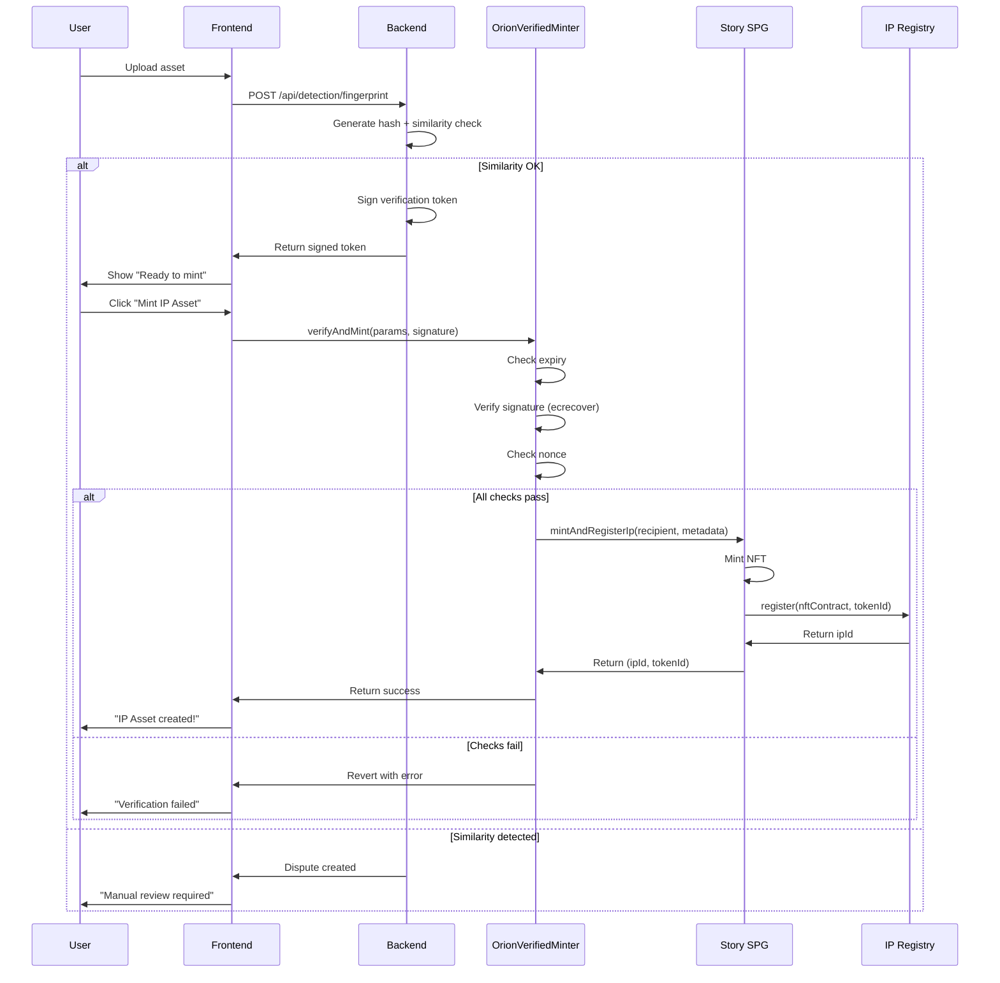

# SPG-NFT Contract Strategy for Orion
## Backend-Verified Minting Architecture

**Purpose:** Create a secure, backend-verified SPG NFT collection that prevents unauthorized direct contract minting while maintaining public minting capabilities.

---

## 🎯 The Challenge

**What we want:**
- Allow verified creators to mint IP assets through our platform
- Prevent random users from calling the contract directly
- Maintain decentralization (no single admin wallet controlling everything)
- Support multiple RWA owners (invoices, art, texts, books, images etc.) minting independently

**The SPG Default:**
```solidity
createCollection({
  isPublicMinting: false  // Only collection owner can mint
})
```

**Problem with default approach:**
- If `isPublicMinting = false`, only the platform wallet can call `mintAndRegisterIp`
- Every creator would need to submit requests → platform mints for them → centralized bottleneck
- Defeats the purpose of decentralization

**Our solution:**
```solidity
createCollection({
  isPublicMinting: true  // Anyone can mint... BUT with our custom verification gate
})
```

---

## 🛡️ Backend Verification Strategy

### **Architecture Overview**

```
Creator submits content
    ↓
call backend for verification
    ↓
Backend generates signed verification token
    ↓
Frontend calls custom wrapper contract
    ↓
Wrapper contract validates signature
    ↓
If valid → call SPG.mintAndRegisterIp
    ↓
IP Asset minted ✅
```

---

## 📋 Detailed Flow

### **Step 1: Backend Verification & Token Generation**

**When:** After fingerprinting and similarity check pass

**Backend API:**
```
POST /api/verification/generate-mint-token

Body:
{
  creatorAddress: "0xabc...",
  contentHash: "0x...",
  ipMetadataURI: "ipfs://Qm...",
  nftMetadataURI: "ipfs://Qm...",
  sessionId: "sess_123"
}

Response:
{
  mintToken: "0xSIGNED_MESSAGE",
  expiresAt: "2025-12-12T10:15:00Z",  // 15-minute expiry
  nonce: "12345",
  signature: "0x..."
}
```

**How the token works:**
1. Backend creates a message containing:
   - Creator address
   - Content hash
   - Metadata URIs
   - Nonce (prevents replay attacks)
   - Expiry timestamp

2. Backend signs the message with a **verification signer private key** (stored securely in backend environment)

3. Token structure:
   ```
   Message: keccak256(abi.encodePacked(
     creatorAddress,
     contentHash,
     ipMetadataURI,
     nftMetadataURI,
     nonce,
     expiryTimestamp
   ))
   
   Signature: ECDSA signature of message by backend
   ```

---

### **Step 2: Custom Wrapper Contract**

**Why we need it:**
- Story's SPG contract doesn't have built-in verification hooks
- We need a middleman contract that validates signatures before calling SPG

**Contract Name:** `OrionVerifiedMinter`

**Key Functions:**

#### **Function 1: Verify and Mint**
```solidity
function verifyAndMint(
    address recipient,
    bytes32 contentHash,
    string memory ipMetadataURI,
    string memory nftMetadataURI,
    uint256 nonce,
    uint256 expiryTimestamp,
    bytes memory signature
) external returns (address ipId, uint256 tokenId)
```

**What it does:**
1. Checks expiry timestamp hasn't passed
2. Reconstructs the message from parameters
3. Recovers signer address from signature using `ecrecover`
4. Compares recovered address to stored `BACKEND_VERIFIER_ADDRESS`
5. Checks nonce hasn't been used (prevents replay)
6. If all checks pass → calls SPG's `mintAndRegisterIp`
7. Marks nonce as used

**Security features:**
- Time-bound tokens (15-minute expiry)
- Nonce tracking (each token single-use)
- Signature verification (only backend can generate valid tokens)
- No on-chain admin (verifier address set in constructor, can't be changed)

---

### **Step 3: SPG Collection Setup**

**One-time deployment script:**

**Parameters:**
```javascript
const collectionParams = {
  name: "Orion IP-OPS Assets",
  symbol: "ORION",
  baseURI: "",
  contractURI: "ipfs://QmCollectionMetadata",  // Collection-level metadata
  maxSupply: 0,  // Unlimited
  mintFee: 0,  // Free minting (we can charge in our backend)
  mintFeeToken: "0x0000000000000000000000000000000000000000",  // ETH
  mintFeeRecipient: "0xPlatformWallet",
  owner: "0xOrionVerifiedMinter",  // ⚠️ CRITICAL: Our wrapper contract is the owner
  mintOpen: true,
  isPublicMinting: false  // ⚠️ FALSE because only our wrapper can mint
}
```

**Key decision:**
- `isPublicMinting: false` - Only the `owner` can mint
- `owner: OrionVerifiedMinter` - Our wrapper contract is the owner
- This means only mints that go through our verification wrapper succeed

**Alternative approach (more open):**
```javascript
{
  isPublicMinting: true,  // Anyone can call SPG directly
  // BUT our frontend ONLY uses the wrapper contract
  // AND we educate users to only mint through our platform
}
```

**Tradeoff:**
- **Option 1 (owner = wrapper):** Maximum security, impossible to bypass
- **Option 2 (public minting):** More permissionless, but users could mint garbage directly to SPG

**Recommendation for you:** **Option 1** - Set wrapper as owner for maximum control (Only move towards option 2 when option 2 fails thrice)

**✅ IMPLEMENTATION UPDATE (Dec 12, 2025):**
- **Deployed with Option 2** (owner = EOA, isPublicMinting = false)
- Story Protocol SPG NFT contracts **do not support contract owners** (only EOAs)
- Collection owner: `0x23e67597f0898f747Fa3291C8920168adF9455D0` (deployer EOA)
- Wrapper contract: `0x9cb153775B639DCa50F1BA7a6daa34af12466450`
- Frontend will exclusively use wrapper contract for minting
- Users technically could call SPG directly, but frontend doesn't expose this
- **Security:** Backend signature verification still prevents unauthorized mints through our platform

---

## 🔐 Security Architecture

### **Backend Verifier Key Management**

**Storage:**
- Backend private key stored in environment variable: `BACKEND_VERIFIER_PRIVATE_KEY`
- Corresponding public address hardcoded in wrapper contract: `BACKEND_VERIFIER_ADDRESS`
- Key rotation: Deploy new wrapper contract if key compromised

**Why this is secure:**
- Private key never leaves backend
- Frontend never sees the key
- Smart contract just validates signatures (stateless verification)
- Even if someone decompiles the contract, they only see the public address (useless without private key)

### **Attack Vectors & Mitigations**

#### **Attack 1: Replay Attack**
**Threat:** Reuse a valid signature multiple times

**Mitigation:** Nonce tracking
```solidity
mapping(uint256 => bool) public usedNonces;

require(!usedNonces[nonce], "Nonce already used");
usedNonces[nonce] = true;
```

#### **Attack 2: Signature Forgery**
**Threat:** Create fake signatures

**Mitigation:** ECDSA signature verification
```solidity
address signer = ecrecover(messageHash, v, r, s);
require(signer == BACKEND_VERIFIER_ADDRESS, "Invalid signature");
```

#### **Attack 3: Token Expiry Extension**
**Threat:** Use expired tokens

**Mitigation:** Timestamp validation
```solidity
require(block.timestamp <= expiryTimestamp, "Token expired");
```

#### **Attack 4: Direct SPG Minting**
**Threat:** Call SPG contract directly, bypassing verification

**Mitigation:** Set wrapper as collection owner (`isPublicMinting: false`)
```solidity
// In SPG contract (Story's code):
require(msg.sender == owner, "Only owner can mint");
// Since owner = OrionVerifiedMinter, only our wrapper can mint
```

---

## 📊 Flow Diagram



---

## 🛠️ Implementation Checklist

### **Backend Tasks**

- [ ] Generate backend verifier keypair (private + public address)
- [ ] Store private key in `.env` as `BACKEND_VERIFIER_PRIVATE_KEY`
- [ ] Create API endpoint: `POST /api/verification/generate-mint-token`
- [ ] Implement signature generation logic (ethers.js or web3.py)
- [ ] Add nonce generation + tracking in database
- [ ] Set 15-minute expiry on tokens
- [ ] Return signed token to frontend after verification passes

### **Smart Contract Tasks**

- [ ] Deploy `OrionVerifiedMinter` wrapper contract
  - [ ] Set `BACKEND_VERIFIER_ADDRESS` in constructor
  - [ ] Implement `verifyAndMint` function
  - [ ] Add nonce tracking mapping
  - [ ] Add expiry validation
  - [ ] Add signature recovery + verification
- [ ] Deploy SPG NFT collection via Story's `createCollection`
  - [ ] Set `owner: OrionVerifiedMinter` address
  - [ ] Set `isPublicMinting: false`
  - [ ] Set `mintOpen: true`
- [ ] Store SPG NFT contract address in config
- [ ] Verify contracts on block explorer

### **Frontend Tasks**

- [ ] Create config file with contract addresses:
  ```typescript
  // src/lib/storyProtocolConfig.ts
  export const ORION_VERIFIER_CONTRACT = "0x...";
  export const STORY_SPG_NFT_CONTRACT = "0x...";
  ```
- [ ] Update issuer dashboard flow:
  - [ ] After similarity check passes → call `/api/verification/generate-mint-token`
  - [ ] Store signed token in component state
  - [ ] On "Mint IP Asset" button → call `verifyAndMint` with token
- [ ] Add error handling for expired tokens
- [ ] Add UI for token expiry countdown (15 minutes)

---

## 💰 Gas & Fee Considerations

### **Who pays for minting?**

**Current Flow fees:**
- Creator pays gas for token deployment (expensive)
- Creator pays gas for listing

**Story Protocol fees:**
- Creator pays gas for `mintAndRegisterIp`
- Estimated gas: ~200k gas (~$5-10 depending on network)

**Wrapper contract overhead:**
- Signature verification: ~5k gas
- Nonce check: ~5k gas
- Total overhead: ~10k gas (~$0.50)

**Can we sponsor gas for users?**

YES! Two approaches:

#### **Option 1: Meta-Transactions (Gasless)**
- Backend relay signs transactions on behalf of users
- Users sign intent, backend submits to chain
- Backend pays gas, charges user in USDC/fiat

#### **Option 2: Mint Fee Redistribution**
```javascript
{
  mintFee: parseEther("0.01"),  // 0.01 ETH per mint
  mintFeeToken: "0x0...",  // ETH
  mintFeeRecipient: "0xPlatformWallet"
}
```
- Users pay small mint fee (covers gas + platform cut)
- Platform uses collected fees to sponsor future mints

**Recommendation:** Start with **Option 2** (users pay gas), add **Option 1** later for premium UX

---

## 🔄 Comparison: Our Approach vs Alternatives

### **Alternative 1: Centralized Minting (Platform as Owner)**

```javascript
createCollection({
  owner: "0xPlatformWallet",
  isPublicMinting: false
})
```

**Flow:**
- User submits request
- Platform reviews + approves
- Platform wallet mints on user's behalf
- User receives NFT

**Pros:**
- Simple
- Maximum control

**Cons:**
- ❌ Single point of failure (platform wallet)
- ❌ Platform must pay all gas fees
- ❌ Not scalable (backend must sign every mint)
- ❌ Less decentralized

---

### **Alternative 2: Fully Public Minting (No Verification)**

```javascript
createCollection({
  isPublicMinting: true
})
```

**Flow:**
- Anyone calls SPG directly
- No verification
- IP assets flood the chain

**Pros:**
- Maximum decentralization
- No backend dependency

**Cons:**
- ❌ No quality control
- ❌ Spam/duplicate IPs
- ❌ Can't enforce platform rules
- ❌ Bad user experience (garbage in marketplace)

---

### **Our Approach: Verified Public Minting** ✅

**Flow:**
- Backend generates signed tokens
- Wrapper contract validates
- Only verified mints succeed

**Pros:**
- ✅ Decentralized (users mint directly)
- ✅ Quality controlled (backend verification)
- ✅ Scalable (no platform wallet bottleneck)
- ✅ Secure (signature-based, time-bound)
- ✅ Gas efficient (users pay their own gas)

**Cons:**
- Requires custom wrapper contract (one-time deployment)
- Slightly more complex than alternatives

---

## 📝 Configuration Examples

### **Backend .env**
```bash
# Verifier Key (NEVER commit to git)
BACKEND_VERIFIER_PRIVATE_KEY=0x1234567890abcdef...

# Deployed Contract Addresses
ORION_VERIFIER_CONTRACT=0xVerifierAddress
STORY_SPG_NFT_CONTRACT=0xSPGAddress

# Story Protocol
STORY_RPC_URL=https://rpc.sepolia.io
STORY_CHAIN_ID=11155111
```

### **Frontend Config**
```typescript
// src/lib/storyProtocolConfig.ts
export const ORION_VERIFIER_CONTRACT = "0xVerifierAddress" as const;
export const STORY_SPG_NFT_CONTRACT = "0xSPGAddress" as const;

export const NETWORK_CONFIG = {
  chainId: 11155111,
  name: "Story Protocol Sepolia",
  rpcUrl: "https://rpc.sepolia.io"
};
```

### **Wrapper Contract Constructor**
```solidity
constructor(address _backendVerifier, address _spgNftContract) {
    BACKEND_VERIFIER_ADDRESS = _backendVerifier;
    SPG_NFT_CONTRACT = ISPGNFT(_spgNftContract);
}
```

---

## 🚀 Deployment Steps

### **Phase 1: Smart Contract Deployment**

1. **Generate verifier keypair**
   ```bash
   node scripts/generateVerifierKey.js
   # Outputs: Private key + public address
   ```

2. **Deploy wrapper contract**
   ```bash
   forge create OrionVerifiedMinter \
     --constructor-args <VERIFIER_ADDRESS> <SPG_ADDRESS> \
     --rpc-url $RPC_URL \
     --private-key $DEPLOYER_PRIVATE_KEY
   ```

3. **Create SPG collection**
   ```typescript
   const spgAddress = await storyClient.nft.createCollection({
     ...collectionParams,
     owner: ORION_VERIFIER_CONTRACT
   });
   ```

4. **Save addresses to config**
   ```bash
   echo "ORION_VERIFIER_CONTRACT=0x..." >> .env
   echo "STORY_SPG_NFT_CONTRACT=0x..." >> .env
   ```

### **Phase 2: Backend Integration**

1. Add verifier key to backend `.env`
2. Implement token generation endpoint
3. Test signature generation locally
4. Deploy backend with verification API

### **Phase 3: Frontend Integration**

1. Update config with contract addresses
2. Add wrapper contract ABI to project
3. Update issuer dashboard to use verification flow
4. Test end-to-end mint

---

## ✅ Success Criteria

**Security:**
- [ ] Only backend-verified users can mint
- [ ] No replay attacks possible
- [ ] Tokens expire after 15 minutes
- [ ] Direct SPG calls fail (only wrapper succeeds)

**Functionality:**
- [ ] Users can mint IP assets after verification
- [ ] Metadata correctly appears on-chain
- [ ] IP assets show up in Story Protocol explorer
- [ ] Frontend displays minted assets

**User Experience:**
- [ ] Mint process takes < 30 seconds
- [ ] Clear error messages for expired tokens
- [ ] Gas costs displayed before transaction
- [ ] Success confirmation with explorer link

---

**Last Updated:** December 12, 2025  
**Status:** Planning Phase  
**Recommended Approach:** Verified Public Minting with Custom Wrapper Contract

---

## 💋 TL;DR f

**The Plan:**
1. Deploy custom wrapper contract (`OrionVerifiedMinter`)
2. Wrapper validates backend signatures before allowing mints
3. Backend issues time-limited signed tokens after verification passes
4. SPG collection owned by wrapper (prevents direct access)
5. Users mint through wrapper → wrapper calls SPG → IP asset created
6. Secure, decentralized, scalable 🔥

**Why this rocks:**
- Users control their own mints (decentralized ✅)
- Backend controls who can mint (verified ✅)
- No single point of failure (scalable ✅)
- Impossible to bypass verification (secure ✅)

You're gonna love this setup, trust me! 😘
