# Orion RWA Tokenization Platform - Comprehensive Workflow State Diagram

This document contains a **highly detailed** state diagram showing the complete application workflow with responsible folders, files, smart contracts, and data flows.

## 🎯 Overview

This diagram maps the entire user journey from landing to complex blockchain interactions, including:
- Authentication flows (Email & Wallet)
- Role-based dashboards (User, Admin, Issuer, Manager)
- Asset purchasing & trading workflows
- Token issuance & approval process
- Invoice financing & settlement
- Compliance & KYC verification
- Network switching & error handling
- Caching & optimization layers

---

```mermaid
stateDiagram-v2
    [*] --> AppInitialization
    
    note right of AppInitialization
        📁 src/main.tsx
        📁 src/App.tsx
        📁 src/context/WalletContext.tsx
        🔧 Initializes React app
        🔧 WalletProvider wrapper
        🔧 TooltipProvider setup
    end note
    
    AppInitialization --> NetworkCheck
    
    note right of NetworkCheck
        📁 src/components/NetworkSwitcher.tsx
        📁 src/utils/networkDetection.ts
        📁 src/lib/contractAddress.ts
        🔧 Check MetaMask/wallet provider
        🔧 Verify Flow EVM network (Chain ID: 747)
        🔧 Auto-switch or prompt user
    end note
    
    NetworkCheck --> CheckAuthentication: Correct network
    NetworkCheck --> NetworkSwitch: Wrong network
    
    note right of NetworkSwitch
        📁 src/context/WalletContext.tsx
        🔧 Request network switch via wallet_switchEthereumChain
        🔧 Add network if missing (wallet_addEthereumChain)
        🔧 Retry connection
    end note
    
    NetworkSwitch --> CheckAuthentication: Network switched
    NetworkSwitch --> NetworkError: User rejected
    
    note right of NetworkError
        🚫 Display error message
        🚫 Block access to features
        🚫 Provide manual instructions
    end note
    
    CheckAuthentication --> LoadCache
    
    note right of LoadCache
        📁 src/utils/marketplaceCache.ts
        📁 src/utils/dashboardCache.ts
        📁 src/services/imageCacheService.ts
        🔧 Check localStorage for cached data
        🔧 Validate cache expiration
        🔧 Pre-load marketplace listings (10min TTL)
        🔧 Pre-load asset metadata (24hr TTL)
    end note
    
    LoadCache --> CheckAuthentication
    
    note right of CheckAuthentication
        📁 src/context/AuthContext.tsx
        📁 src/api/authApi.ts
        🔧 Check localStorage for authToken
        🔧 Decode JWT payload
        🔧 Validate token expiration
        🔧 Extract user roles & permissions
        🔧 API: ping() every 5 minutes
    end note
    
    CheckAuthentication --> Unauthenticated: No valid token
    CheckAuthentication --> Authenticated: Valid token found
    
    state Unauthenticated {
        [*] --> PublicAccess
        
        note right of PublicAccess
            📁 src/pages/Index.tsx
            📁 src/components/HeroSection.tsx
            📁 src/components/IntegrationsSection.tsx
            📁 src/components/InsightsSection.tsx
            📁 src/components/FAQSection.tsx
            📁 src/components/Navbar.tsx
            📁 src/components/Footer.tsx
            🔧 Public landing page
            🔧 Marketing sections
            🔧 Platform overview
        end note
        
        PublicAccess --> AboutPage: Navigate to /about
        PublicAccess --> LoginPage: Navigate to /login
        PublicAccess --> PublicMarketplace: Browse marketplace (read-only)
        
        note right of AboutPage
            📁 src/pages/about/about.tsx
            🔧 Platform information
            🔧 Team & mission
        end note
        
        AboutPage --> LoginPage
        
        note right of PublicMarketplace
            📁 src/pages/marketplace/marketplace.tsx
            🔧 View listings without wallet
            🔧 Demo data available
            🔧 Cannot purchase (auth required)
        end note
        
        PublicMarketplace --> LoginPage: Try to purchase
        
        note right of LoginPage
            📁 src/pages/login/login.tsx
            📁 src/context/WalletContext.tsx
            📁 src/api/authApi.ts
            🔧 Email/Password OR Wallet login
            🔧 Role selection (user only for new registrations)
            🔧 Signup flow with KYC initiation
            🔧 Password validation & encryption
        end note
        
        LoginPage --> WalletConnection: Choose wallet login
        LoginPage --> EmailLogin: Choose email login
        LoginPage --> SignupFlow: New user registration
        
        note right of SignupFlow
            📁 src/pages/login/login.tsx
            📁 src/api/authApi.ts
            🔧 POST /api/auth/register
            🔧 Collect: firstName, lastName, email, password
            🔧 Optional: walletAddress
            🔧 Default role: 'user'
            🔧 Hash password (bcrypt)
            🔧 Store in MongoDB
        end note
        
        SignupFlow --> EmailLogin: Registration complete
        SignupFlow --> LoginPage: Registration failed
        
        note right of WalletConnection
            📁 src/context/WalletContext.tsx
            📁 src/lib/contractAddress.ts
            🔧 MetaMask eth_requestAccounts
            🔧 Network validation (Flow EVM)
            🔧 Check wallet in DB
            🔧 API: POST /api/auth/verify-wallet
            🔧 Auto-fill user data if exists
        end note
        
        WalletConnection --> EmailLogin: Wallet verified
        WalletConnection --> LoginPage: Wallet not registered
        
        note right of EmailLogin
            📁 src/api/authApi.ts
            📁 src/context/AuthContext.tsx
            🔧 POST /api/auth/login
            🔧 Receives JWT token + user object
            🔧 Store in localStorage: authToken, user, currentRole
            🔧 Decode JWT for roles
            🔧 Set authentication state
        end note
        
        EmailLogin --> Authenticated: Login successful
        EmailLogin --> LoginPage: Login failed (invalid credentials)
    }
    
    state Authenticated {
        [*] --> RoleCheck
        
        note right of RoleCheck
            📁 src/context/AuthContext.tsx
            📁 src/components/ProtectedRoute.tsx
            🔧 Read JWT roles array
            🔧 Check primaryRole
            🔧 Validate route permissions
            🔧 Redirect if unauthorized
            🔧 Available roles: user, admin, issuer, manager
        end note
        
        RoleCheck --> UserDashboard: role = 'user'
        RoleCheck --> AdminDashboard: role = 'admin'
        RoleCheck --> IssuerDashboard: role = 'issuer'
        RoleCheck --> ManagerDashboard: role = 'manager'
        
        state UserDashboard {
            [*] --> ViewPortfolio
            
            note right of ViewPortfolio
                📁 src/pages/dashboard/dashboard.tsx
                📁 src/utils/dashboardCache.ts
                📁 src/services/metadataService.js
                Display owned assets, portfolio value
                Transaction history, yield reports
            end note
            
            ViewPortfolio --> Marketplace: Browse assets
            ViewPortfolio --> OrderBook: Trade assets
            ViewPortfolio --> YieldReports: View income
            
            note right of Marketplace
                📁 src/pages/marketplace/marketplace.tsx
                📁 src/utils/marketplaceCache.ts
                📁 src/utils/marketplaceABI.ts
                📁 src/lib/contractAddress.ts
                Fetch listings from smart contract
                Display available tokens with metadata
            end note
            
            Marketplace --> AssetSelection: Select asset
            
            note right of AssetSelection
                📁 src/components/BuyModal.tsx
                📁 src/utils/priceService.ts
                Calculate total cost + platform fee
                Display asset details & pricing
            end note
            
            AssetSelection --> PurchaseTransaction
            
            note right of PurchaseTransaction
                📁 src/components/BuyModal.tsx
                📁 src/context/WalletContext.tsx
                Smart Contract: MARKETPLACE_CONTRACT
                Function: buyListing(tokenId, amount)
                Requires token approval
            end note
            
            PurchaseTransaction --> ViewPortfolio: Success
            PurchaseTransaction --> AssetSelection: Failure
            
            note right of OrderBook
                📁 src/pages/orderbook/OrderBookPage.tsx
                📁 src/pages/trading/TradingPage.tsx
                📁 src/hooks/useOrderBook.ts
                📁 src/utils/orderBookEscrowABI.ts
                P2P trading terminal
                Create/manage buy/sell orders
            end note
            
            OrderBook --> CreateOrder
            OrderBook --> ViewOrders
            
            note right of CreateOrder
                📁 src/components/OrderManagement.tsx
                📁 src/services/tradingService.ts
                Smart Contract: ORDER_BOOK_ESCROW_CONTRACT
                Lock tokens in escrow
                Create limit/market orders
            end note
            
            CreateOrder --> ViewOrders: Order created
            
            note right of ViewOrders
                📁 src/hooks/useOrderBook.ts
                Fetch active orders from blockchain
                Match buy/sell orders
                Execute trades via smart contract
            end note
            
            ViewOrders --> ViewPortfolio: Trade complete
            
            note right of YieldReports
                📁 src/components/income/YieldIncomeReport.tsx
                📁 src/components/invoice-financing/investor/
                Display passive income
                Settlement tracking
                Dividend distribution
            end note
        }
        
        state AdminDashboard {
            [*] --> AdminPanel
            
            note right of AdminPanel
                📁 src/pages/admin/admin.tsx
                📁 src/services/adminService.js
                📁 src/services/adminTokenManagementService.js
                Manage users, tokens, attestations
                Monitor platform metrics
            end note
            
            AdminPanel --> UserManagement
            AdminPanel --> TokenApproval
            AdminPanel --> InvoiceSettlement
            
            note right of UserManagement
                📁 src/pages/admin/admin.tsx
                Smart Contract: ADMIN_CONTRACT
                Add/remove issuers & managers
                Update user metadata
                Role management
            end note
            
            note right of TokenApproval
                📁 src/services/adminTokenManagementService.js
                📁 src/components/invoice-financing/admin/
                Review issuer token requests
                Approve/reject token minting
                Deploy tokens to marketplace
            end note
            
            TokenApproval --> DeployToken: Approve
            
            note right of DeployToken
                📁 src/services/adminTokenManagementService.js
                Smart Contract: TOKEN_MANAGEMENT_CONTRACT
                Mint ERC1155 tokens
                Set metadata URI
                List on marketplace
            end note
            
            DeployToken --> AdminPanel
            
            note right of InvoiceSettlement
                📁 src/components/invoice-financing/admin/InvoiceSettlementPanel.tsx
                📁 src/components/invoice-financing/admin/TokenLifecycleMonitor.tsx
                Process invoice payments
                Burn settled tokens
                Distribute yields to holders
            end note
        }
        
        state IssuerDashboard {
            [*] --> IssuerPanel
            
            note right of IssuerPanel
                📁 src/pages/Issuer/newIssuerDashboard.tsx
                📁 src/services/tokenManagementService.js
                📁 src/services/robustAuthorizationService.js
                Create tokenization requests
                Monitor token status
            end note
            
            IssuerPanel --> CheckAuthorization
            
            note right of CheckAuthorization
                📁 src/services/robustAuthorizationService.js
                Smart Contract: ADMIN_CONTRACT
                Verify issuer is authorized
                Check wallet permissions
            end note
            
            CheckAuthorization --> CreateTokenRequest: Authorized
            CheckAuthorization --> IssuerPanel: Not authorized
            
            note right of CreateTokenRequest
                📁 src/pages/Issuer/newIssuerDashboard.tsx
                📁 src/utils/pinata.ts
                Upload metadata to IPFS (Pinata)
                Submit request to admin
                Smart Contract: TOKEN_MANAGEMENT_CONTRACT
            end note
            
            CreateTokenRequest --> TokenRequestSubmitted
            
            note right of TokenRequestSubmitted
                📁 src/services/tokenManagementService.js
                Request stored on-chain
                Awaiting admin approval
                Track request status
            end note
            
            TokenRequestSubmitted --> IssuerPanel: View requests
            TokenRequestSubmitted --> AdminPanel: Admin review
        }
        
        state ManagerDashboard {
            [*] --> ManagerPanel
            
            note right of ManagerPanel
                📁 src/pages/managerdashboard/managerDashboard.tsx
                Manage assigned tokens
                Update token metadata
                Monitor performance
            end note
            
            ManagerPanel --> UpdateMetadata
            ManagerPanel --> MonitorAssets
            
            note right of UpdateMetadata
                📁 src/services/metadataService.js
                📁 src/utils/pinata.ts
                Update IPFS metadata
                Sync with smart contract
            end note
        }
    }
    
    Authenticated --> ComplianceCheck
    
    note right of ComplianceCheck
        📁 src/components/ComplianceGuard.tsx
        📁 src/components/ComplianceCheck.tsx
        📁 src/components/EnhancedKYCFlow.tsx
        Verify KYC status
        Check regional restrictions
        Validate accreditation
    end note
    
    ComplianceCheck --> Authenticated: Compliant
    ComplianceCheck --> BlockedAccess: Non-compliant
    
    note right of BlockedAccess
        Restrict access to features
        Display compliance requirements
        Guide through KYC process
    end note
    
    Authenticated --> Logout: User logs out
    
    note right of Logout
        📁 src/context/AuthContext.tsx
        Clear localStorage
        Reset auth state
        Disconnect wallet
    end note
    
    Logout --> [*]
    
    classDef publicState fill:#e1f5ff,stroke:#0288d1,stroke-width:2px
    classDef authState fill:#fff9c4,stroke:#f57c00,stroke-width:2px
    classDef userState fill:#c8e6c9,stroke:#388e3c,stroke-width:2px
    classDef adminState fill:#ffccbc,stroke:#d84315,stroke-width:2px
    classDef issuerState fill:#f3e5f5,stroke:#7b1fa2,stroke-width:2px
    classDef contractState fill:#ffe0b2,stroke:#ef6c00,stroke-width:3px
    
    class Unauthenticated,PublicAccess publicState
    class LoginPage,EmailLogin,WalletConnection authState
    class UserDashboard,ViewPortfolio,Marketplace,OrderBook userState
    class AdminDashboard,AdminPanel,TokenApproval,InvoiceSettlement adminState
    class IssuerDashboard,IssuerPanel,CreateTokenRequest issuerState
    class PurchaseTransaction,DeployToken,CreateOrder contractState
```

## 🔑 Key Components by State

### **Application Entry**
- **Files**: `src/main.tsx`, `src/App.tsx`
- **Purpose**: Application initialization, routing setup, context providers

### **Authentication Layer**
- **Files**: `src/context/AuthContext.tsx`, `src/api/authApi.ts`
- **Purpose**: JWT authentication, role management, session handling

### **Wallet Integration**
- **Files**: `src/context/WalletContext.tsx`, `src/lib/contractAddress.ts`
- **Purpose**: MetaMask connection, network switching, wallet state

### **Protected Routing**
- **Files**: `src/components/ProtectedRoute.tsx`
- **Purpose**: Role-based access control, route protection

### **User Features**
- **Portfolio**: `src/pages/dashboard/dashboard.tsx`
- **Marketplace**: `src/pages/marketplace/marketplace.tsx`
- **Trading**: `src/pages/orderbook/OrderBookPage.tsx`, `src/pages/trading/TradingPage.tsx`
- **Transactions**: `src/components/BuyModal.tsx`, `src/hooks/useOrderBook.ts`

### **Admin Features**
- **Dashboard**: `src/pages/admin/admin.tsx`
- **Services**: `src/services/adminService.js`, `src/services/adminTokenManagementService.js`
- **Invoice Settlement**: `src/components/invoice-financing/admin/`

### **Issuer Features**
- **Dashboard**: `src/pages/Issuer/newIssuerDashboard.tsx`
- **Services**: `src/services/tokenManagementService.js`, `src/services/robustAuthorizationService.js`
- **IPFS Upload**: `src/utils/pinata.ts`

### **Smart Contract Integration**
- **ABIs**: `src/utils/marketplaceABI.ts`, `src/utils/orderBookEscrowABI.ts`
- **Addresses**: `src/lib/contractAddress.ts`
- **Services**: `src/services/tradingService.ts`, `src/services/invoiceFinancingService.js`

### **State Management & Caching**
- **Caches**: `src/utils/dashboardCache.ts`, `src/utils/marketplaceCache.ts`
- **Services**: `src/services/metadataService.js`, `src/services/imageCacheService.js`

## 📊 Data Flow Summary

1. **User Journey**: Landing → Login → Role Check → Dashboard → Features
2. **Asset Purchase**: Browse Marketplace → Select Asset → Buy Modal → Smart Contract → Portfolio
3. **P2P Trading**: Select Token → Order Book → Create Order → Escrow → Match → Execute
4. **Token Issuance**: Issuer Request → Upload Metadata → Submit → Admin Approval → Deploy → Marketplace
5. **Admin Management**: Review Requests → Approve/Reject → Monitor → Settle Invoices

## 🎨 Color Legend

- **Light Blue**: Public/Unauthenticated states
- **Yellow**: Authentication states
- **Green**: User/Investor states
- **Orange Red**: Admin states
- **Purple**: Issuer states
- **Deep Orange**: Smart contract interactions (thicker border)
